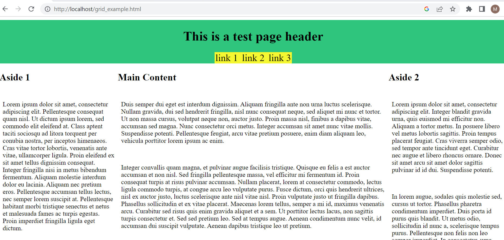

# Formatting a Webpage with CSS FlexBox

## Introduction 

There are many ways to format a webpage. All proper ways involve CSS. CSS stands for cascading style sheet and is the standard way for formating and organizing elements on a webpage. If you have visited an appealing webpage it's because the developer used CSS. If you have ever noticed a page that resembles a plain Word document like the following you have encounter a webpage with little to no CSS.

### Webpage without CSS


The basic way to format a webpage is to organize the page into rows and columns. For example, it is typical to block out a section at the top to the webpage for a header this is usually formatted as a row. Below this header is the main content of the page that may involve two asides on either side. 

### webpage with heading and two asides


I'll admit this is not the most appealing grid layout, but it shows the basic structure. Webpages will often also include a footer at the bottom of the page with links to more resources and general information.

## How to work with Flexbox

Before we discuss how to use flexbox we need to breifly talk about inheritance for CSS. For hearchy we must use the html file we are styling. Elements nested inside other elements will inherit the same styles as their parent unless overwritten in some way by the child. 
    ```html
        <body>
        <div>
            <h1>This is a test page</h1>
        </div>
        </body>
    ```
In this example the div is the child of the body tag and h1 tag is the child of the div. If the body tag contains CSS that sets the font color for the body tag, the text in the div and h1 tag will be the same color as text directly in the body tag.

Now that we have a basic concept of inheritance we can discuss the basics of flexbox. There are two main constructs we must use in flex box, containers and items. Containers are the space in which we want to organize our items. The items in the container will be its children and will inherit various properties such as size, orientation, and abilities to shrink or grow. A flexbox container must specify the attibute 
        ```css
            display:flex;
        ```
in order to function properly. This propery can be placed in a .css file specifing the tag name and entering the property for the example I will use a body tag.
    ``` body{
            display:flex;
    }
    ```
Although, I prefer to use a class to create a container because I indicate which html elements recieve the css properties. This is useful for organization when many of the same tag exist on a webpage. The "." in the following css indicate that it is a class.
    ``` .container{
        display:flex;
    }
    ```

To connect a style sheet the a webpage put the following link element in the head of your html page and indicate the relative path to the style sheet.
```html 
     <head>
     
        <link rel="stylesheet" href="css/style.css">
        <!-- Links to stylesheets -->
    </head>
```
Let's first start by creating a flex row. First make a css class that contains the following properties. 
``` css
    .container{
        display: flex;
        flex-direction: row;
    }
```
The default layout of the flex display is a row but I like to specify the flex-direction anyways. Next we need to create a css class for the child elements so the we can recognize the effects and format the individual items. 

```css
    .flexItems{
        border-radius: 20pt;
        border-style: solid;
        border-width: 1pt;
        box-sizing: border-box;
        padding: 1em;
    }
```
The border-radius determines the rounding of border edges. The border-style indicates the type border in this case a solid line. The box-sizing <a href="https://www.w3schools.com/css/css3_box-sizing.asp">attribute</a> includes the padding and border in the total width of an element. It helps to make the formating easier to predict. The padding creates distance between the border and the content of the element.

Next in your html create a div. Give it the class name of your container. Then create a few div elements inside of the afore mentioned division. It should resemble the following:

```html
     <div class="container">
        <div class="flexItem">
            <p>
                item 1
            </p>
        </div>
        <div class="flexItem">
            <p>
                item 2
            </p>
        </div>
        <div class="flexItem">
            <p>
                item 3
            </p>
        </div>
        <div class="flexItem">
            <p>
                item 4
            </p>
        </div>
    </div>
```
When displayed, the webpage should look like following.


To change the layout simply change the flex-direction ``` flex-direction: column; ```. This will cause the items to display as a stack of rows and the column will fill the parent elements size.


To format a page we will use these basics with a few added attributes. We will use two main containers to format the page. One will contain the header and the other the main content of the body. For our example, we will use a column flex-direction in the header and a row flex direction for the body. The body will contain three flex items. There will be two asides and one larger item in the middle for the main content of the page. Each of these items will be flex containers with the flex direction set to column to store paragraphs images or other content verically. This is an example of how to format the heading. In this cause I created a heading class.

```css
    .heading{
        display: flex;
        flex-direction: column;
        align-items: center;
        background-color: rgb(48, 197, 125);  
}
```
The ``` align-items:center;``` attribute centers the items in the column, if the flex-diection was set to row and you wanted to center the child elements you would need to set ```justify-content: center;  ```. This attribute centers the items in the main axis of the page. For a more comprehensive knowledge of aligning items in flexbox visit <a href="https://developer.mozilla.org/en-US/docs/Web/CSS/CSS_Flexible_Box_Layout/Aligning_Items_in_a_Flex_Container">this mozilla page.</a> Now we will want to create a flex container for our main body. In our case our's will be fairly simple.

```css
    .main{
        display: flex;
        flex-direction:row;
        box-sizing:border-box;
    }
```
For the items in the main body we can assign what percentage of the row any individual item occupies. We do this using the flex property. It is important to note that padding and margins of elements can contribute the overall length of the row and change how your layout displays. For my asides I will assign ``` flex: 20%; ``` and in my middle item I will assign ```flex:50%;``` this ensures that the middle will be bigger than the side columns. Give the classes for your asides and middle items the properties ``` display:flex; 
flex-direction:column;```  this creates redundancy if any of the children of the item are inline by default. You will also want to add some padding to text elements to prevent text from coliding between columns. Alternatively, the padding can be put in the aside and middle item classes.

This will give you the basic grid display.



Personally, I like borders on my display. I will not cover borders anymore than I already have on this post, but have fun experimenting with border shapes and sizes. 

## Other Resources

Flexbox has many other capabilites that I have not discussed here. There are many places to learn more about how to better utizile this technology. https://developer.mozilla.org/en-US/docs/Web/CSS/CSS_Flexible_Box_Layout/Basic_Concepts_of_Flexbox is a great place to get started. Mozilla contains detailed documentation of the flexbox attributes and can aid your understanding of how these attributes work together. While you can research different formatting attributes and cobble then together for your own Frankenstein creation, a solid understanding of flex and its attributes will help you avoid unexpected displays.

https://css-tricks.com/snippets/css/a-guide-to-flexbox/ demonstrates the unique ways flexbox can be used to format elements via alignment and spacing.

https://www.geeksforgeeks.org/introduction-to-css-flexbox/ is another introduction guide to flexbox, if you feel the need to consult another tutorial.

https://sharkcoder.com/layout/flexbox is a detailed beginners guide and is more in depth on layout features of flex like wraping rows and specifying how flex items should shrink or grow.

https://www.w3schools.com/css/css3_flexbox_responsive.asp this resource gives examples of how to change css format of a page at different screen sizes. This is useful because one css sheet can contain different syles for mobile and full sized screens. 

https://developer.mozilla.org/en-US/docs/Web/CSS/CSS_Flexible_Box_Layout/Aligning_Items_in_a_Flex_Container this link gives a detailed description of the alignment of items on the cross axis and main axis. This page can be useful if you are confused about which attributes and settings will put your ideal format on the page.


