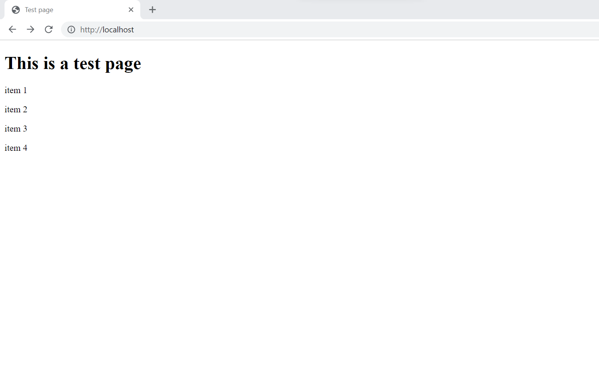

# Formatting a Webpage with CSS FlexBox

## Introduction 

There are many ways to format a webpage. All proper ways involve CSS. CSS stands for cascading style sheet and is the standard way for formating and organizing elements on a webpage. If you have visited an appealing webpage its because the developer used CSS. If you have ever noticed a page that resembles a plain Word document like the following you have encounter a webpage with little to no CSS.

### Webpage without CSS



The basic way to format a webpage is to organize the page into rows and columns. For example, it is typical to block out a section at the top to the webpage for a header this is usually formatted as a row. Below this header is the the main content of the page that may involve two asides on either side. 

### webpage with heading and two asides


I'll admit this is not the most appealing grid layout, but it shows the basic structure. Webpages will often also include a footer at the bottom of the page with links to more resources and general information.

## How to work with Flexbox

Before we discuss how to use flexbox we need to breifly talk about inheritance for CSS. For hearchy we must use the html file we are styling. Elements nested inside other elements will inherit the same styles as their parent unless overwritten in some way by the child. 
    ```html
        <body>
        <div>
            <h1>This is a test page</h1>
        </div>
        </body>
    ```
In this example the div is the child of the body tag and h1 tag is the child of the div. If the body tag contains CSS that would change the font color for the body tag the text in the div and h1 tag will be the same color as text directly in the body tag.

Now that we have a basic concept of inheritance we can discuss the basics of flexbox. There are two main constructs we must use in flex box, containers and items. Containers are the space in which we want to organize our items. The items in the container with be its children and will inherit various properties such as size, orientation, and abilities to shrink or grow. A flexbox container must specify the the attibute 
        ```css
            display:flex;
        ```
in order to function properly. This propery can be placed in a .css for a tag by specifing the tag name and entering the property for the example I will use a body tag.
    ``` body{
            display:flex;
    }
    ```
Although I prefer to use a class to create a container because I indicate which html elements recieve the css properties. This is useful for organization when many of the same tag exist on a webpage. The "." in the following css indicate that it is a class.
    ``` .container{
        display:flex;
    }
    ```

To connect a style sheet the a webpage put the following link element in the head of your html page and indicate the relative path to the style sheet.
```html 
     <head>
     
        <link rel="stylesheet" href="css/style.css">
        <!-- Links to stylesheets -->
    </head>
```
Let's first start by creating a flex row. First make a css class that contains the following properties. 
``` css
    .container{
        display: flex;
        flex-direction: row;
    }
```
The default layout of the flex display is a row but I like to specify the flex-direction anyways. Next we need to create a css class for the child elements so the we can recognize the effects and format the individual items. 

```css
    .flexItems{
        border-radius: 20pt;
        border-style: solid;
        border-width: 1pt;
        box-sizing: border-box;
        padding: 1em;
    }
```
The border-radius determines the rounding of the edges of the border. The border-style indicates the border will be a solid line. The box-sizing <a href="https://www.w3schools.com/css/css3_box-sizing.asp">attribute</a> includes the padding and boarder in the total width of an element. It helps to make the formating easier to predict. The padding creates distance between the border and the content of the element.

Next in your html create a div give it a class name of you container. Then create a few div elements inside of the afore mentioned division. It should resemble the following

```html
     <div class="container">
        <div class="flexItem">
            <p>
                item 1
            </p>
        </div>
        <div class="flexItem">
            <p>
                item 2
            </p>
        </div>
        <div class="flexItem">
            <p>
                item 3
            </p>
        </div>
        <div class="flexItem">
            <p>
                item 4
            </p>
        </div>
    </div>
```
When displayed the webpage it should look like following.


To change the layout simply change the flex-direction ``` flex-direction: column; ```. This will cause the items to display as a stack of rows and the column will fill the parent elements size.


To format a page we will use these basics with a few added attributes.  